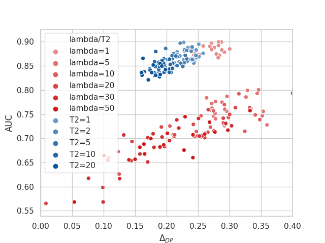

# FairAdj

Peizhao Li, Yifei Wang, Han Zhao, Pengyu Hong, and Hongfu
Liu. "[On Dyadic Fairness: Exploring and Mitigating Bias in Graph Connections](https://openreview.net/pdf?id=xgGS6PmzNq6)
, ICLR 2021.

Disparate impact has raised serious concerns in machine learning applications and its societal impacts. In response to
the need of mitigating discrimination, fairness has been regarded as a crucial property in algorithmic designs. In this
work, we study the problem of disparate impact on graph-structured data. Specifically, we focus on dyadic fairness,
which articulates a fairness concept that a predictive relationship between two instances should be independent of the
sensitive attributes. Based on this, we theoretically relate the graph connections to dyadic fairness on link predictive
scores in learning graph neural networks, and reveal that regulating weights on existing edges in a graph contributes to
dyadic fairness conditionally. Subsequently, we propose our algorithm, FairAdj, to empirically learn a fair adjacency
matrix with proper graph structural constraints for fair link prediction, and in the meanwhile preserve predictive
accuracy as much as possible. Empirical validation demonstrates that our method delivers effective dyadic fairness in
terms of various statistics, and at the same time enjoys a favorable fairness-utility tradeoff.

## Reference

    @inproceedings{
    li2021on,
    title={On Dyadic Fairness: Exploring and Mitigating Bias in Graph Connections},
    author={Peizhao Li and Yifei Wang and Han Zhao and Pengyu Hong and Hongfu Liu},
    booktitle={International Conference on Learning Representations},
    year={2021},
    url={https://openreview.net/forum?id=xgGS6PmzNq6}
    }

---

## Setup

Please check or adjust the environment configurations in `req.txt` for PyTorch since the CUDA version may differ.

    conda create -n fairadj --file req.txt
    conda activate fairadj

## Experiment

Data for Cora and Citeseer are stored in `./data`.  
Execute python file in `./src`:
    
    cd src

Experiments on FairAdj:

    python main.py --dataset "cora" --device "cuda:0" --eta 0.2 --T2 20
    python main.py --dataset "citeseer" --device "cuda:0" --eta 5. --T2 20

You can set `T2` to various values, see Figure 1 and 6 in our paper for more results.

Experiments on Adversarial Graph Embedding:

    python adv.py --dataset "cora" --device "cuda:0" --lr 0.001 --alpha 10.
    python adv.py --dataset "citeseer" --device "cuda:0" --lr 0.001 --alpha 10.

Similarly, `alpha` can be set to various values, see Figure 1 and 6 in our paper for more results.

## Results

We provide all the experimental results and figures in `./res`.